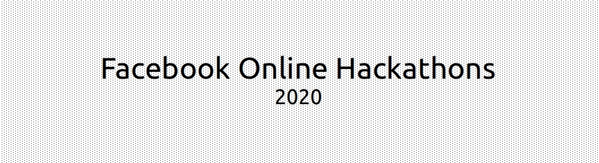

### Facebook Online Hackathons 2020

Among the four online hackathons organized by Facebook on [devpost](www.devpost.com), I had participated in two of them. The first one (Hackathon 2) was the first time I was working with Facebook Graph API. However, the second one (Hackathon 3) was a quite joyful experience.

#### Hackathon 2 (Zyx The Bot)
The idea was to implement an event ticketing api through facebook messenger. Where users will be able to signup for events around them and get the tickets directly to their inbox. It was quite a failure :3

- Django
- HTML/CSS
- Heroku
- SQLite

#### Hackathon 3 (Citrogen)
The second time I tried to approach the hackathons in a casual way. I made a messenger bot that scrapped the front page of Internet AKA **Reddit** for memes, jokes, puns etc. and deliver them to users' inbox. Comparatively, it performed better than the previous one. I even ran a beta campaign in my Facebook friendlist.

- Django
- PyMessenger (by @davidchua)
- Heroku
- PostgreSQL

